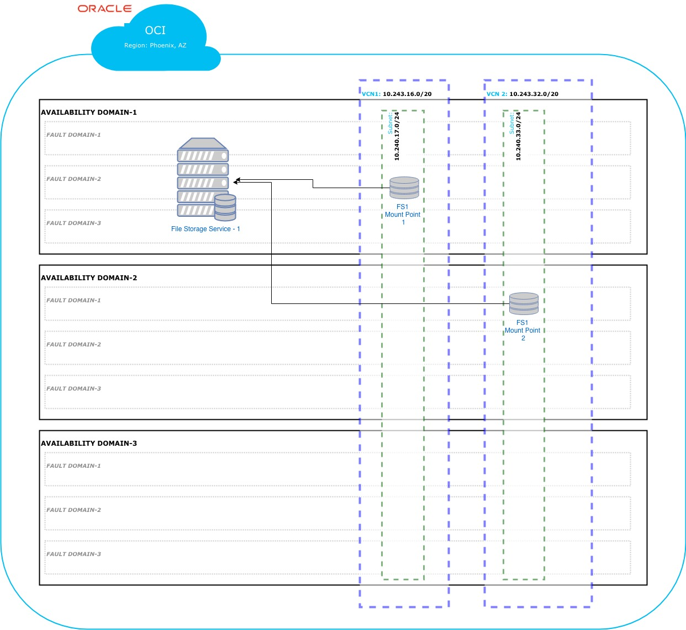
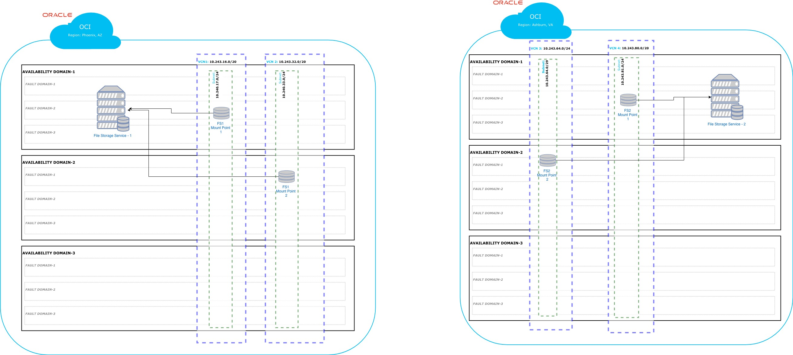

# Oracle Cloud Infrastructure (OCI) File Storage Service Module for Terraform

## Introduction
This module provides a way to provision an Oracle Cloud Infrastructure File Storage Service(FSS) instance when you need to have a shared storage between multiple compute instances. 
This serves as a foundational component in an OCI environment, providing the ability to provision File Storage Service instances.

## Solution

The Mount Target functionality can expose an FSS instance to multiple VCNs, enabling you to have one or more mount targets in different VCNs/Subnets but in the same availability domain (AD). 
The mount target will contain one export set and export configuration.

This module provides the ability to create storage that supports the following use cases:
* Shared storage between virtual machines (VMs) that are in the same region, in the same VCN/subnet, or in a different VCN/subnet
  *  
* Multiple FSS instances across different regions or tenancies for replication or disaster recovery
  *  
  
An example shows how you can use two instances of this module output to provision 2 FSSs in two different regions/tenancies. You can configure the instances in an architectural (tf) module for FSS storage replication.  

### Prerequisites
This module does not create any dependencies or prerequisites. 

Create the following before using this module: 
  * Required IAM construct to allow for the creation of resources
  * VCNs/Subnets

The following are not required to create the FSS resources, but are required for traffic to flow:
  * Security List(s)
    * The *network_security* module may be used to create and manage NFS Security Lists.
  * Route Table
    * Often times only a couple of routing policies exist and are created in the *network* module.
  * DHCP Options
    * Often times only a couple of DHCP Options (DNS profiles) exist and are created in the *network* module.

	
## Getting Started

Several fully-functional examples are provided in the `examples` directory.  

The following scenarios are covered in the examples:
* Provisioning a single FSS instance with 1 mount target attached to a subnet 
* Provisioning multiple FSSs instances in the same region
* Provisioning 2 FSS instances in two different regions/tenancies.

This module supports any combination of these scenarios.

## Accessing the Solution
This core service module is typically used at deployment, with no further access required.

## Module Inputs

### Provider
This module supports a custom provider. With a custom provider, a single project Terraform (tf) automation can manage FSSs provisioning across multiple tenancies or regions.

You'll manage the providers in the tf automation projects where you reference this module.

Example:

```
provider "oci" {
  alias            = "primary"
  tenancy_ocid     = "${var.primary_tenancy_id}"
  user_ocid        = "${var.primary_user_id}"
  fingerprint      = "${var.primary_fingerprint}"
  private_key_path = "${var.primary_private_key_path}"
  region           = "${var.primary_region}"
}

provider "oci" {
  alias            = "dr"
  tenancy_ocid     = "${var.dr_tenancy_id}"
  user_ocid        = "${var.dr_user_id}"
  fingerprint      = "${var.dr_fingerprint}"
  private_key_path = "${var.dr_private_key_path}"
  region           = "${var.dr_region}"
}
```

The following IAM attributes are available in the the `terraform.tfvars` file:

```
### PRIMARY TENANCY DETAILS

# Get this from the bottom of the OCI screen (after logging in, after Tenancy ID: heading)
primary_tenancy_id="<tenancy OCID"
# Get this from OCI > Identity > Users (for your user account)
primary_user_id="<user OCID>"

# the fingerprint can be gathered from your user account (OCI > Identity > Users > click your username > API Keys fingerprint (select it, copy it and paste it below))
primary_fingerprint="<PEM key fingerprint>"
# this is the full path on your local system to the private key used for the API key pair
primary_private_key_path="<path to the private key that matches the fingerprint above>"

# region (us-phoenix-1, ca-toronto-1, etc)
primary_region="<your region>"

### DR TENANCY DETAILS

# Get this from the bottom of the OCI screen (after logging in, after Tenancy ID: heading)
dr_tenancy_id="<tenancy OCID"
# Get this from OCI > Identity > Users (for your user account)
dr_user_id="<user OCID>"

# the fingerprint can be gathered from your user account (OCI > Identity > Users > click your username > API Keys fingerprint (select it, copy it and paste it below))
dr_fingerprint="<PEM key fingerprint>"
# this is the full path on your local system to the private key used for the API key pair
dr_private_key_path="<path to the private key that matches the fingerprint above>"

# region (us-phoenix-1, ca-toronto-1, etc)
dr_region="<your region>"
```


### File System
The file_system input variable represents a map of attributes for an FSS, including a map of corresponding Mount Targets and their corresponding attributes, including export_set and export.
The automation creates the following resources with the following attributes:

**`oci_file_storage_file_system.file_system`**

| Attribute | Data Type | Required | Default Value | Description |
|---|---|---|---|---|
| provider | string | yes | "oci.custom_provider"| See the examples section for how to set the provider for the specific FSS |
| count | number | yes | 0 | The number of resources to be created |
| display\_name | string | yes | "shared_file_system" | String of the display name Resource Name | 
| compartment\_id | string | yes | none | The OCI of the compartment that will contain this LPG resource |
| availability\_domain | string | yes | N/A (no default) | The specified AD |
| define\_tags | map(string) | no | N/A (no default) | The defined tags |
| freeform\_tags| map(string) | no | N/A (no default) | The freeform\_tags |


**`oci_file_storage_mount_target.mount_target`**

| Attribute | Data Type | Required | Default Value | Description |
|---|---|---|---|---|
| provider | string | yes | "oci.custom_provider"| See the examples section for how to set the provider for the specific FSS | 
| count | number | yes | 0 | Numeric | The number of resources to be created |
| availability\_domain | string | yes | NONE | The corresponding FSS availability domain |
| compartment\_id | string | yes | NONE | string of the compartment OCID |
| subnet\_id | string | yes | N/A (no default) | The OCID of the VCN in which the Mount Target will be attached |
| display\_name | string | yes | "mount_target" | string of the display name |
| define\_tags | map(string) | no | The FSS corresponding values | The defined tags
| freeform\_tags| map(string) | no | The FSS corresponding values | The freeform\_tags
| hostname\_label | string | no | N/A (no default) | The provided hostname\_label label |
| ip\_address | string | no | N/A (no default) | Provided ip address\_address label |


**`oci_file_storage_export_set.export_set`**

| Attribute | Data Type | Required | Default Value | Description |
|---|---|---|---|---|
| provider | string | yes | "oci.custom_provider"| See the examples section for how to set the provider for the specific FSS | 
| count | number | yes | 0 | the number of resources to be created |
| `mount_target_id` | string | yes | The corresponding Mount Target OCID | The corresponding Mount Target OCID |
| display\_name | string | yes | "mount_target" | string of the display name |
| max\_fs\_stat\_bytes | number | no | N/A (no default) | The shared storage size|
| max\_fs\_stat\_files| number | no | N/A (no default) | The shared storage size |


**`oci_file_storage_export.export`**
  
| Attribute | Data Type | Required | Default Value | Description |
|---|---|---|---|---|
| provider | string | yes | "oci.custom_provider"| See the examples section for how to set the provider for the specific FSS | 
| count | number | yes | 0 | the number of resources to be created |
| export\_set\_id | string | yes | The corresponding Export Set OCID | The corresponding Export Set OCID |
| file\_system\_id | string | yes | The corresponding File System OCID | The corresponding File System OCID |
| path | string | yes | "/my_share" | share path |
| export_options.source | string | yes | 0.0.0.0/0 | The CIDR that contains the NFS clients|
| export_options.access | string | no | READ_WRITE | The access type to the shared storage |
| export_options.anonymous_gid | string | no |  N/A (no default) | anonymous group id |
| export_options.anonymous_uid | string | no |  N/A (no default) | anonymous user id |
| export_options.identity_squash | string | no |  NONE | Squash Identity |
| export_options.require_privileged_source_port| string | no |  false | Source Port |

**Example**
The following example creates one FSS and one Mount target.

```
file_storage_config = {
  default_compartment_id = "<default_compartment_ocid>"
  default_defined_tags   = "<default_defined_tags>"
  default_freeform_tags  = "<default_freeform_tags>"
  default_ad             = "<default_ad>"
  file_systems = {
    fs_1 = {
      ad             = 1
      compartment_id = "<specific_compartment_ocid>"
      defined_tags   = "<specific_defined_tags>"
      freeform_tags  = "<specific_freeform_tags>"
    }
  }
  mount_targets = {
    fs1_mt1 = {
      ad             = "<ad_number_integer>"
      subnet_id      = "<subnet_id>"
      hostname_label = "fs1-mt1"
      ip_address     = "<ip_address>"
      compartment_id = "<specific_compartment_ocid>"
      defined_tags   = "<specific_defined_tags>"
      freeform_tags  = "<specific_freeform_tags>"
      export_set = {
        max_fs_stat_bytes = "<max capacity in bytes>"
        max_fs_stat_files = "<max files capacity>"
      }
    }
  }
  exports = {
    fs1_mt1_export_set1_export1 = {
      path          = "<mount path>"
      export_option = "standard_export_options"
      mount_target  = "<mount target name>"
      file_system   = "<file system name>"
    }
  }
  export_options = {
    standard_export_options = {
      source                         = "0.0.0.0/0"
      access                         = "READ_WRITE"
      anonymous_gid                  = null
      anonymous_uid                  = null
      identity_squash                = "NONE"
      require_privileged_source_port = "false"
    }
  }
}
```


## Outputs

This module returns 1 object and 3 objects maps:
* `file_systems`: Contains the details about the provisioned File System 
* `mount_targets`: Contains a map of mount targets 
* `export_sets`: Contains a map of export sets that belong to the upper mt - one single export_set per mt
* `exports`: Contains a map of exports that belong to the upper export set and maps and mt with an fs.


## URLs

For Oracle Cloud Infrastructure File Storage Service documentation, see https://docs.cloud.oracle.com/iaas/Content/File/Concepts/filestorageoverview.htm

## Versions

This module has been developed and tested by running terraform on macOS Mojave Version 10.14.5

```
user-mac$ terraform --version
Terraform v0.12.3
+ provider.oci v3.31.0
```

## Contributing

This project is open source. Oracle appreciates any contributions that are made by the open source community.

## License

Copyright (c) 2020 Oracle and/or its affiliates.

Licensed under the Universal Permissive License v 1.0 as shown at https://oss.oracle.com/licenses/upl.

See [LICENSE](LICENSE) for more details.
